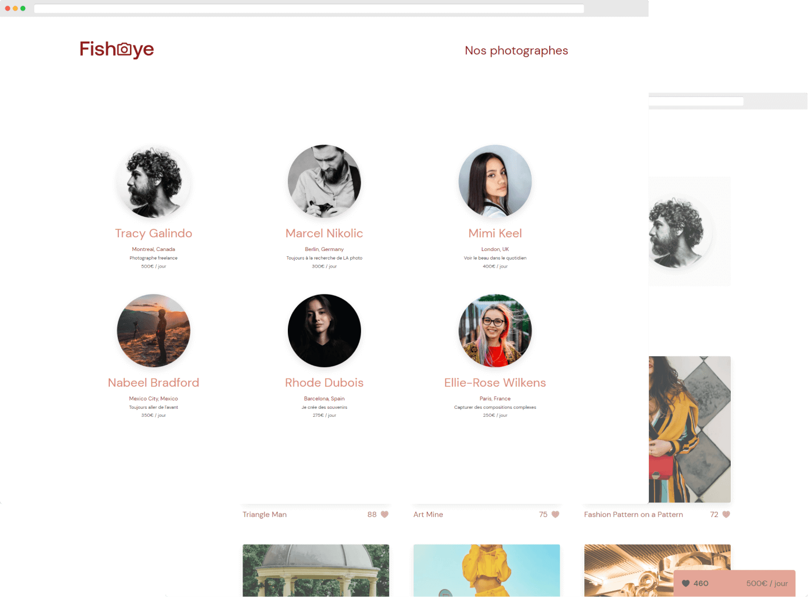
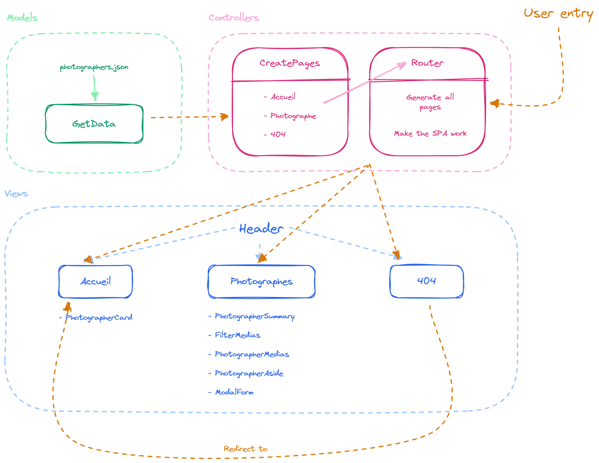

# FishEye



## Overview

The project was to build a web application that allows photographers to upload their photos and share them with the world.

For this project, I built this application as a Single Page Application.

## Features

For this project I used the following technologies:

- HTML / SCSS
- JavaScript (vanilla)
- [ViteJS](https://vitejs.dev/)

## Local Setup

### Clone the repository

```bash
git clone https://github.com/alexperronnet/openclassrooms-p6-fisheye.git
```

### Navigate to the project folder

```bash
cd openclassrooms-p6-fisheye
```

### Install dependencies

```bash
npm install
```

### Run the application

```bash
npm run dev
```

## Project Structure

- `src/`:
  - `data/`: contains the JSON data.
  - `scripts/`: contains the JavaScript files.
    - `controllers/`: contains the controllers.
    - `models/`: contains the models.
    - `views/`: contains the views.
  - `styles/`: contains the SCSS files.

## Architecture



## Deployment

The application is deployed on [Netlify](https://www.netlify.com/).

## License

This is an OpenClassrooms project. The code is freely reusable, but assets (images, videos and logo) are not because they are not mine.

If you are also a student of OC, you can freely use my work as inspiration, but I advise you not to copy parts of it.
